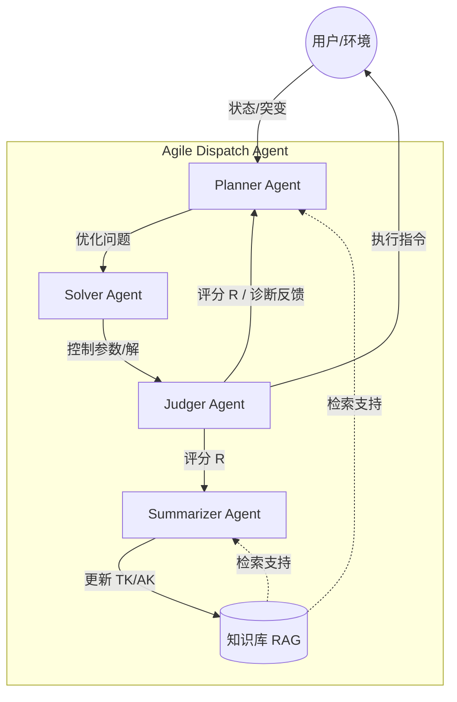

# Agile Dispatch Agent (ADA): 知识驱动的复杂系统敏捷调度智能体

## 1. 项目简介

ADA 是一个端到端的自动化优化与调度框架，旨在解决动态场景下"语义-物理脱节"的问题。系统采用多智能体协作架构，通过知识驱动的动态演化过程（Knowledge-driven Dynamic Evolution Process），实现从非结构化需求感知到严谨数学求解的闭环。

### 核心理念

- **Planner**: 负责将模糊需求转化为精确的数学模型（Active State Augmentation）
- **Solver**: 实现问题特征与求解算法的自适应对齐（Problem-Algorithm Alignment）
- **Judger**: 执行"物理硬指标+逻辑软指标"的双重评估与故障诊断
- **Summarizer**: 基于 MCTS 搜索进行经验回溯，更新知识库（TK/AK），实现自我进化

## 2. 系统架构图



## 3. 目录结构

```
ours/
├── config/                 # 全局配置中心
│   ├── __init__.py
│   ├── llm_config.py      # LLM 接口配置
│   └── system_config.py   # 系统参数配置
│
├── utils/                  # 通用工具层
│   ├── __init__.py
│   ├── const.py           # 数据契约定义
│   ├── interact.py        # 接口抽象基类
│   └── logger.py          # 统一日志工具
│
├── knowledgebase/          # 知识库服务层
│   ├── __init__.py
│   ├── Embeddings.py      # Embedding 模型
│   ├── VectorBase.py      # 向量数据库
│   ├── LLM.py             # LLM 服务封装
│   └── service.py         # 知识服务接口
│
├── Planner/                # 规划智能体
│   ├── __init__.py
│   ├── core.py            # Planner 核心逻辑
│   ├── prompt.py          # Prompt 模板
│   └── tools/             # 工具注册表
│       ├── __init__.py
│       └── registry.py
│
├── Solver/                 # 求解智能体
│   ├── __init__.py
│   ├── core.py            # Solver 核心逻辑
│   ├── feature.py         # 特征提取
│   ├── prompt.py          # Prompt 模板
│   └── Template/          # 算法模板库
│       ├── __init__.py
│       ├── base.py        # 算法基类
│       ├── convex.py      # 凸优化
│       ├── pso.py         # 粒子群优化
│       ├── bayesian.py    # 贝叶斯优化
│       ├── genetic.py     # 遗传算法
│       └── gradient.py    # 梯度下降
│
├── Judger/                 # 评估智能体
│   ├── __init__.py
│   ├── core.py            # Judger 核心逻辑
│   ├── prompt.py          # Prompt 模板
│   ├── Reward/            # 评分模块
│   │   ├── __init__.py
│   │   ├── base_reward.py
│   │   ├── phy_reward.py  # 物理评分
│   │   └── llm_reward.py  # LLM 评分
│   └── Debug/             # 调试模块
│       ├── __init__.py
│       └── feedback.py    # 反馈生成
│
├── Summarizer/             # 总结智能体
│   ├── __init__.py
│   ├── core.py            # Summarizer 核心逻辑
│   ├── prompt.py          # Prompt 模板
│   └── knowledge_updater.py # 知识更新器
│
├── test/                   # 测试模块
│   ├── __init__.py
│   └── test_all.py        # 综合测试
│
├── log/                    # 日志目录
├── main.py                 # 系统入口
└── readme.md               # 本文档
```

## 4. 模块通信协议

各 Agent 间通过标准数据对象通信（定义在 `utils/const.py`）：

### OptimizationProblem (Planner -> Solver)
```python
class OptimizationProblem:
    objective_function_latex: str   # 目标函数 LaTeX
    objective_function_code: str    # 目标函数代码
    constraints_latex: List[str]    # 约束条件
    variables: List[VariableDefinition]  # 决策变量
    parameters: Dict[str, float]    # 参数常量
```

### Solution (Solver -> Judger)
```python
class Solution:
    is_feasible: bool              # 是否可行
    algorithm_used: str            # 使用的算法
    decision_variables: Dict[str, float]  # 最优解
    objective_value: float         # 目标值
    convergence_curve: List[float] # 收敛曲线
```

### Feedback (Judger -> Planner/Summarizer)
```python
class Feedback:
    feedback_type: FeedbackType    # 反馈类型
    score: float                   # 综合评分
    diagnosis: str                 # 诊断信息
    suggested_fix: str             # 修复建议
```

## 5. 快速开始

### 5.1 环境配置

```bash
# 创建虚拟环境
python -m venv venv
source venv/bin/activate  # Linux/Mac
# venv\Scripts\activate   # Windows

# 安装依赖
pip install -r requirements.txt
```

### 5.2 配置 LLM

创建 `.env` 文件：
```env
CLOUD_MODEL=deepseek-chat
CLOUD_API_KEY=your_api_key
CLOUD_BASE_URL=https://api.deepseek.com

OPENAI_API_KEY=your_openai_key
OPENAI_BASE_URL=https://api.openai.com/v1
OPENAI_API_MODEL=text-embedding-3-small
```

### 5.3 运行测试

```bash
# 运行综合测试
python -m test.test_all

# 运行主程序（Mock 模式）
python main.py
```

### 5.4 使用示例

```python
from main import ADAOrchestrator
from utils.const import EnvironmentState

# 创建编排器
orchestrator = ADAOrchestrator(use_mock=False)  # 使用真实 LLM

# 创建环境状态
env_state = EnvironmentState(
    user_instruction="优化电网调度，最小化发电成本",
    real_data={"load": 100.0, "price": 0.5}
)

# 运行
result = orchestrator.run(env_state)

if result["success"]:
    print(f"最优解: {result['solution'].decision_variables}")
    print(f"目标值: {result['solution'].objective_value}")
```

## 6. 扩展指南

### 6.1 添加新工具

```python
from Planner.tools.registry import BaseTool

class MyTool(BaseTool):
    @property
    def name(self) -> str:
        return "my_tool"
    
    @property
    def description(self) -> str:
        return "我的自定义工具"
    
    def execute(self, **kwargs) -> Any:
        # 实现工具逻辑
        return {"result": "..."}

# 注册工具
registry.register(MyTool())
```

### 6.2 添加新算法

```python
from Solver.Template.base import BaseAlgorithm

class MyOptimizer(BaseAlgorithm):
    @property
    def meta(self) -> SolverAlgorithmMeta:
        return SolverAlgorithmMeta(
            name="MyOptimizer",
            description="我的优化算法",
            capabilities={
                "convex_handling": 0.8,
                "non_convex_handling": 0.6,
                # ...
            }
        )
    
    def _solve_impl(self, problem: OptimizationProblem) -> Dict[str, Any]:
        # 实现求解逻辑
        return {
            "feasible": True,
            "variables": {...},
            "objective": 0.0
        }

# 注册算法
solver.register_strategy(MyOptimizer())
```

### 6.3 自定义评分器

```python
from Judger.Reward.base_reward import BaseReward

class MyReward(BaseReward):
    def forward(self, problem, solution) -> Tuple[float, Dict]:
        # 实现评分逻辑
        score = ...
        details = {...}
        return score, details
```

## 7. 参考文献

本项目基于以下核心思想：

1. **主动状态增广 (Active State Augmentation)**
   - 通过工具调用链扩充环境状态
   - 公式: $x_0 \xrightarrow{t_0} x_1 \xrightarrow{t_1} \dots \xrightarrow{t_n} x_n$

2. **问题-算法对齐 (Problem-Algorithm Alignment)**
   - 将优化问题映射到特征空间
   - 通过对齐评分选择最佳算法
   - 公式: $G(A, \phi) = \sum_{f_i \in \phi} w(f_i) \cdot \frac{\psi_i(A) \cdot (k_1 + 1)}{\psi_i(A) + K(A)}$

3. **MCTS 驱动的知识更新**
   - 使用蒙特卡洛树搜索识别高价值决策路径
   - 自动提炼和更新知识库

## 8. 许可证

MIT License
