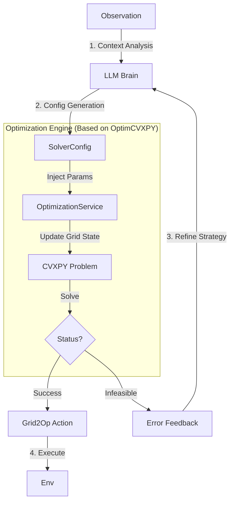

# 终极设计文档: Optimization-Augmented ReAct Agent (OARA)

## 1. 项目愿景与核心架构

**核心目标**: 打造一个具备“数学直觉”的智能体。

* **传统痛点**: `OptimCVXPY` 只有一套固定的惩罚系数（“死板”），无法应对突发的极端情况；`ReAct` 只有模糊的语言推理（“瞎猜”），无法生成精确的调度指令。
* **解决方案**: **LLM 充当“超参数优化师”**。LLM 不直接生成动作，而是根据当前电网的**危急程度 (Criticality)** 和 **安全裕度 (Safety Margin)**，动态调整优化器的**目标函数权重**和**物理约束边界**。

**系统架构图**:



---

## 2. 详细模块设计

### 2.1 优化引擎层 (`OptimizationService`)

**设计意图**: 重构 `OptimCVXPY`。不仅仅是一个 Agent，而是一个可调用的**无状态服务**。

**关键修改**:
需要继承或复用 `OptimCVXPY` 类，但必须开放参数修改接口。

**文件位置**: `ADA/OptLLM/analysis/optimization_service.py`

#### 类定义规范

```python
from OptimCVXPY.optimCVXPY import OptimCVXPY
import cvxpy as cp

class OptimizationService(OptimCVXPY):
    def __init__(self, env, action_space):
        # 复用父类初始化，建立 CVXPY 问题结构
        super().__init__(action_space, env)
        
    def solve_with_config(self, observation, config: dict) -> dict:
        """
        核心接口：接收观测 + 配置，返回动作
        """
        try:
            # Step 1: 注入动态参数 (核心创新点)
            # 直接修改 CVXPY 的 Parameter 对象的值
            self._penalty_curtailment_unsafe.value = config.get("penalty_curtailment", 0.1)
            self._penalty_redispatching_unsafe.value = config.get("penalty_redispatch", 0.03)
            self._penalty_storage_unsafe.value = config.get("penalty_storage", 0.3)
            self._margin_th_limit.value = config.get("margin_th_limit", 0.9)
            
            # Step 2: 更新电网状态参数 (复用父类逻辑)
            # 注意：这里只调用 update_parameters 但不执行 act
            self.update_parameters(observation, unsafe=True)
            
            # Step 3: 求解 (复用父类逻辑)
            # compute_optimum_unsafe 内部会调用 prob.solve()
            curtailment, storage, redispatching = self.compute_optimum_unsafe()
            
            # Step 4: 结果验证
            # 检查是否全为 NaN (父类求解失败会返回 NaN)
            if np.all(np.isnan(curtailment)):
                return {
                    "status": "INFEASIBLE",
                    "reason": "Solver returned NaN (Constraints too tight or numerical issue)"
                }
            
            # Step 5: 转换为 Grid2Op 动作
            action = self.to_grid2op(observation, curtailment, storage, redispatching, safe=False)
            
            return {
                "status": "SUCCESS",
                "action": action,
                "metrics": {
                    "curtailment_mw": np.sum(curtailment),
                    "redispatch_mw": np.sum(np.abs(redispatching))
                }
            }
            
        except Exception as e:
            return {"status": "ERROR", "reason": str(e)}

```

### 2.2 LLM 决策层 (`OptAgent`)

**设计意图**: LLM 不再关注具体的发电机 ID，而是关注**高层策略**。

#### Tool 定义 (JSON Schema)

这是 LLM 唯一能看到的工具描述，必须精准。

```json
{
  "name": "run_optimization_solver",
  "description": "运行数学优化器来计算具体的电网调度指令。你可以通过调整惩罚权重和安全裕度来控制优化器的行为。",
  "parameters": {
    "type": "object",
    "properties": {
      "strategy_description": {
        "type": "string",
        "description": "简要描述你的策略意图，例如'轻微过载，保守调整'或'极度危险，允许切负荷'。"
      },
      "penalty_curtailment": {
        "type": "number",
        "description": "切负荷(Curtailment)的惩罚权重。默认0.1。\n- 高值(>1.0): 极力避免切负荷（保护用户）。\n- 低值(<0.05): 允许切负荷以换取安全（紧急模式）。"
      },
      "penalty_redispatch": {
        "type": "number",
        "description": "再调度(Redispatch)的惩罚权重。默认0.03。通常保持较低值。"
      },
      "margin_th_limit": {
        "type": "number",
        "description": "热极限安全裕度 (0.8 ~ 1.0)。\n- 0.9: 标准安全模式（留10%缓冲）。\n- 0.98: 激进模式（允许接近极限运行，用于难以解决的拥堵）。"
      }
    },
    "required": ["penalty_curtailment", "margin_th_limit"]
  }
}

```

### 2.3 提示词工程 (System Prompt Design)

必须教 LLM 如何映射“场景”到“参数”。在 `prompts.py` 中实现：

```python
SYSTEM_PROMPT = """
你是一个电网高级调度指挥官。你的任务不是手动计算，而是配置并指挥强大的“数学优化引擎”来解决电网过载。

### 核心决策逻辑：
你必须根据观测到的**过载严重程度 (rho)** 和 **剩余时间 (steps)** 来调整优化参数：

1. **场景 A：轻微过载 (rho < 1.05)**
   - **策略**: 保守治疗。绝对不切负荷，仅调整发电机。
   - **参数建议**: 
     - `penalty_curtailment`: 10.0 (设为极高，禁止切负荷)
     - `margin_th_limit`: 0.9 (保持标准安全裕度)

2. **场景 B：严重过载 (rho > 1.10) 或 时间紧迫 (steps_left < 2)**
   - **策略**: 紧急避险。安全第一，允许切负荷，允许设备短时满载。
   - **参数建议**:
     - `penalty_curtailment`: 0.001 (设为极低，鼓励切负荷保线)
     - `margin_th_limit`: 0.99 (放宽限制，利用所有物理能力)

3. **场景 C：优化器反馈“无解 (Infeasible)”**
   - **策略**: 进一步妥协。
   - **参数建议**: 进一步提高 `margin_th_limit` (最高 1.0)，或尝试调整其他权重。

### 你的思考过程 (Think):
1. 分析当前 `rho` 和 `overflow` 情况。
2. 判断处于哪个场景 (A/B/C)。
3. 设定具体的参数值。
4. 调用工具 `run_optimization_solver`。
"""

```

---

## 3. 完整工作流逻辑 (Implementation Logic)

这是一个状态机逻辑，指导 `agent.py` 的编写。

```python
def act(self, observation):
    # 1. 基础检查
    if not self._is_danger(observation):
        return self._do_maintenance() # 安全时做维护

    # 2. ReAct 循环 (Max 3 steps)
    history = self.init_history(observation)
    
    for i in range(3):
        # LLM 思考
        response = self.llm.chat(history)
        
        # 解析动作
        if "run_optimization_solver" in response:
            # 提取参数
            params = parse_json(response)
            
            # === 关键步骤：调用优化服务 ===
            result = self.opt_service.solve_with_config(observation, params)
            
            if result["status"] == "SUCCESS":
                # 成功！直接返回计算出的物理动作
                logger.info(f"OARA Success: {params['strategy_description']}")
                return result["action"]
            
            else:
                # 失败！将错误喂回 LLM，让其调整参数重试
                # 例如：告诉 LLM "约束太紧，请放宽 margin"
                feedback = f"Observation: 优化求解失败 (Infeasible)。原因: {result['reason']}。建议：尝试放宽 margin_th_limit 或降低 penalty_curtailment。"
                history.append(user_message(feedback))
                continue
        
        else:
            # LLM 犯傻没调工具，或者决定 Do Nothing
            return self.parse_manual_action(response)
            
    # 兜底：如果几次尝试都失败，返回空动作
    return self.action_space({})

```